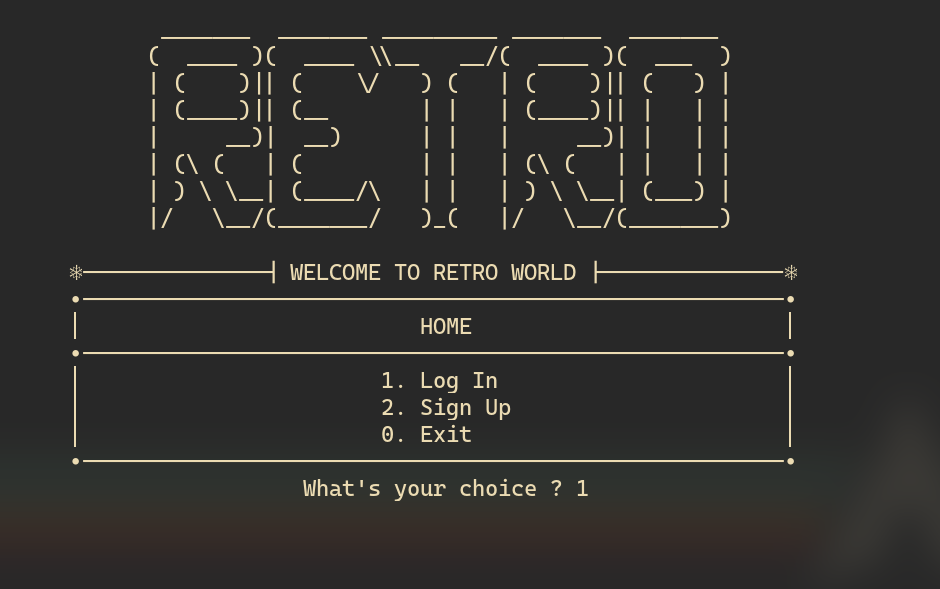
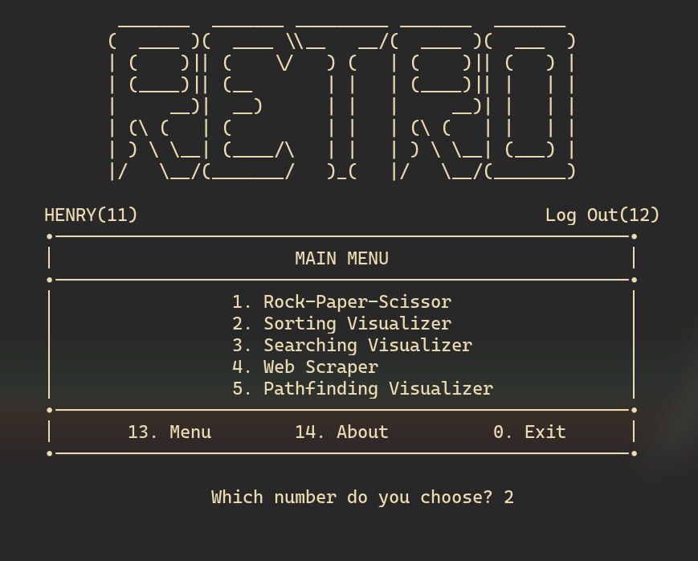
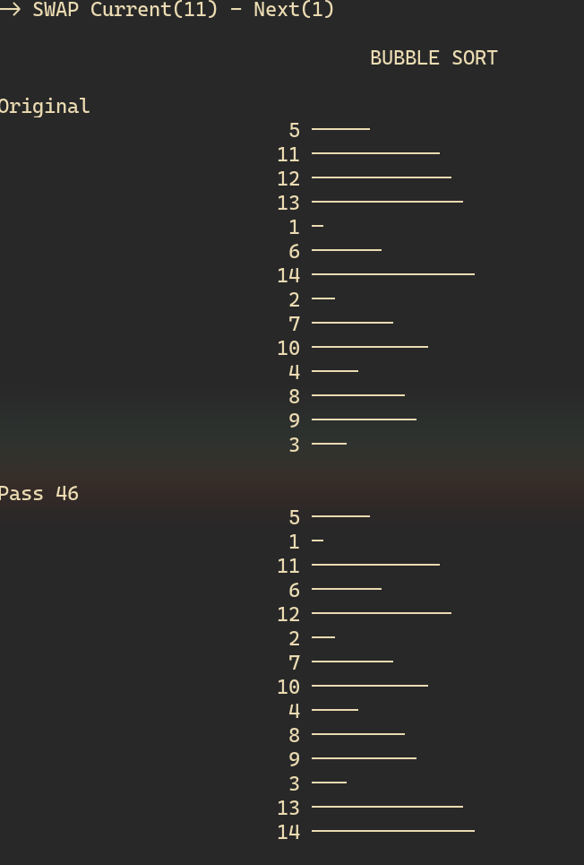
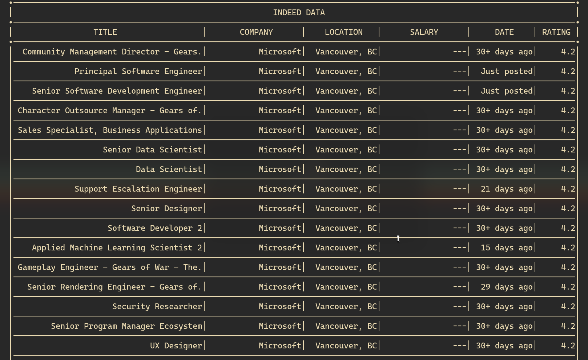
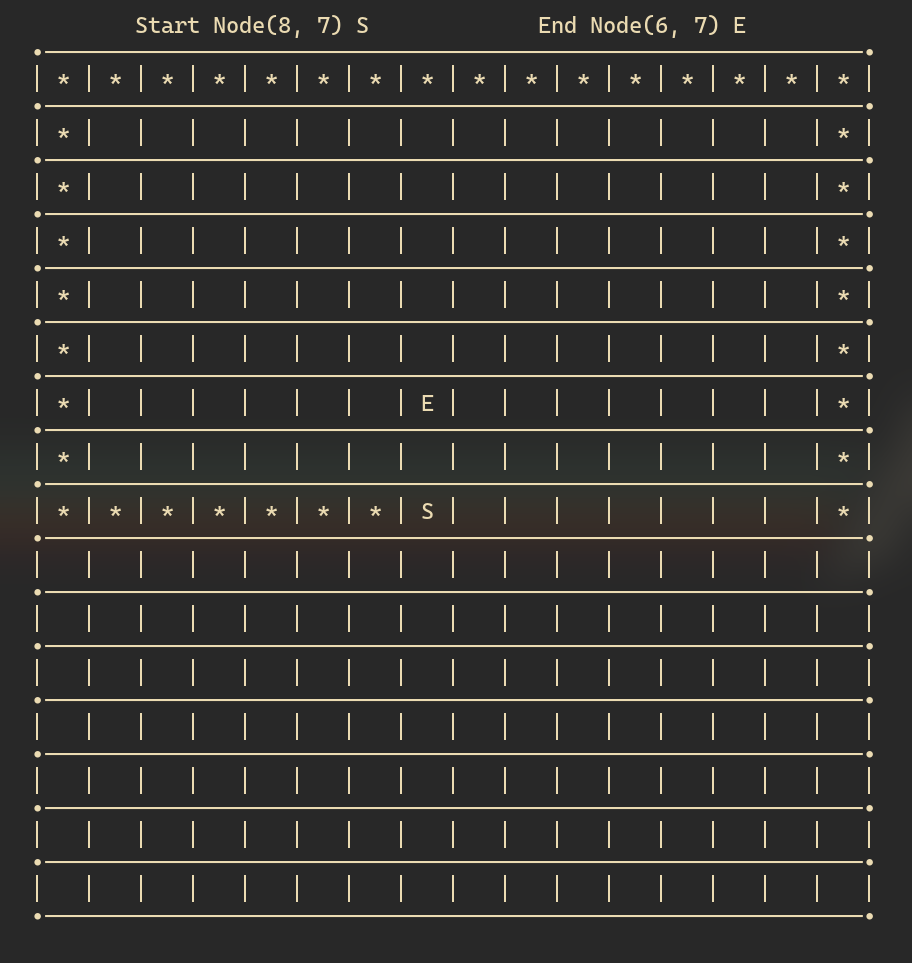

# RETRO

#### This project is built on Linux OS. Windows and Mac OS will NOT be compatible at the moment...Compile this project on Linux environment or Virtual Machine (AWS Amazon, Linux distros, ...) is REQUIRED

## Table of contents

- [General info](#general-info)
- [Installation](#installation)
- [Usage](#usage)
- [Demo](#demo)
- [Screenshots](#screenshots)
- [Features](#features)
- [Status](#status)
- [License](#license)
- [Contact](#contact)

## General info

Retro is a minimal system that visualizes practical algorithms (Sorts, Searches, Pathfinders,...) and fundamental knowledge of database, data scraping.

## Installation

Requires below softwares preinstalled locally (The link is used for Arch users, other distros will be diffrent)

- [gcc](https://archlinux.org/packages/core/x86_64/gcc/)
- [python](https://www.python.org/downloads/)
- [python-requests ](https://archlinux.org/packages/extra/any/python-requests/)
- [python-pandas](https://archlinux.org/packages/community/x86_64/python-pandas/)
- [python-beautifulsoup4](https://archlinux.org/packages/community/any/python-beautifulsoup4/)

To compile, open terminal (Linux) and run this command:

```
$ git clone https://github.com/henry-ta/Retro ; cd Retro
$ make clean ; make ; ./Retro
```

## Usage

- Uses appropriate number to navigatate between functions

## Demo

https://youtube.com/embed/VSA25TIuNnc

## Screenshots

Home


Main Menu


Sorting Visualizer


Web Scraper


Pathfinder


## Features

Sorting Visualizer

- Binary Insertion Sort
- Bubble Sort
- Heap Sort
- Insertion Sort
- Merge Sort
- Quick Sort
- Selection Sort
- Shell Sort

Searching Visualizer

- Binary Search
- Exponential Search
- Fibonacy Search
- Jump Search
- Linear Search

Web Scraper

- Indeed Scraper

Pathfinder

- Spiral Recursion

Others

- Rock, Paper, Scissor

## Status


## License

[](https://www.gnu.org/licenses/gpl-3.0.html)

## Contact

Created by [Henry Ta](https://github.com/Henry-Ta)
